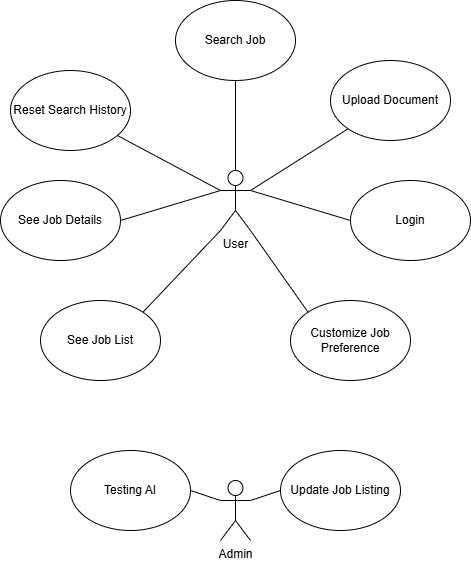
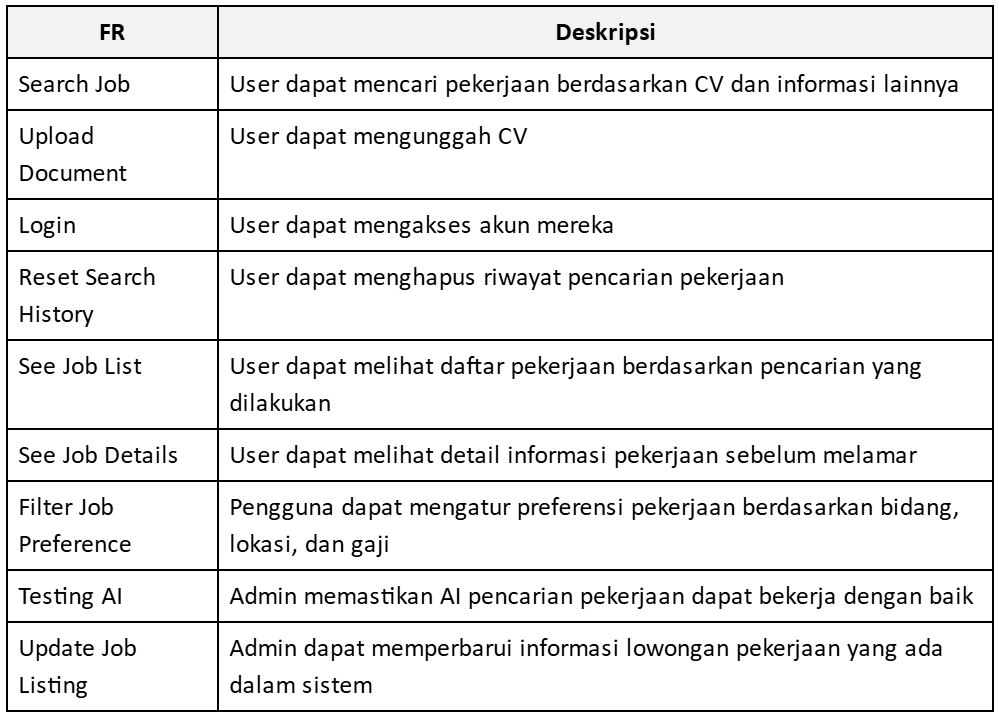
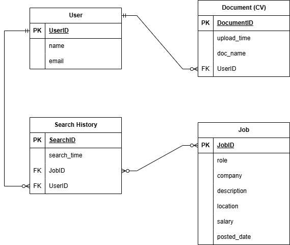
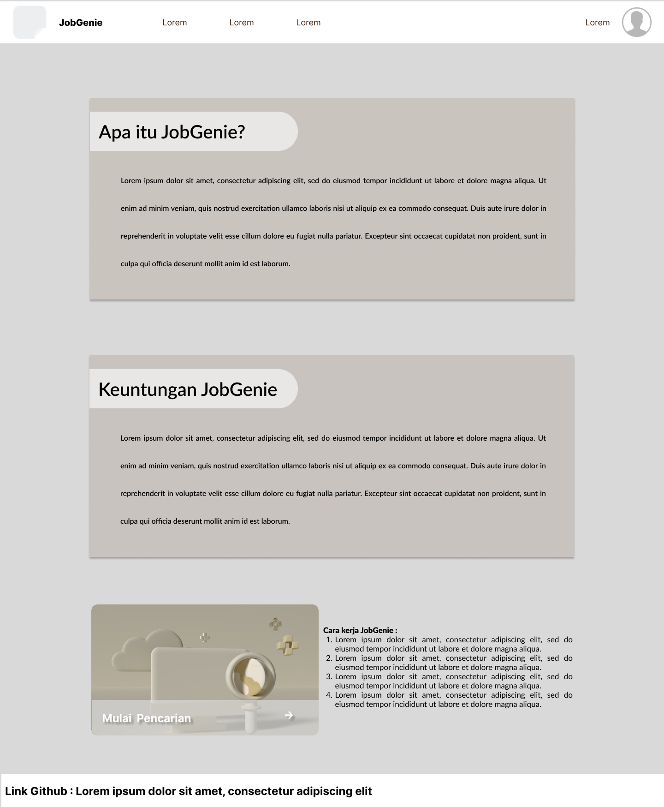
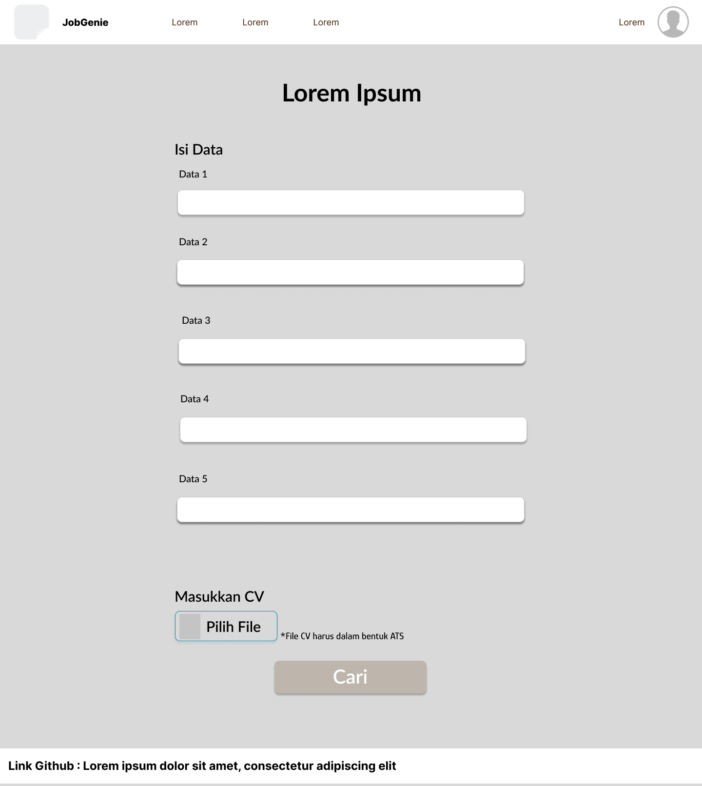
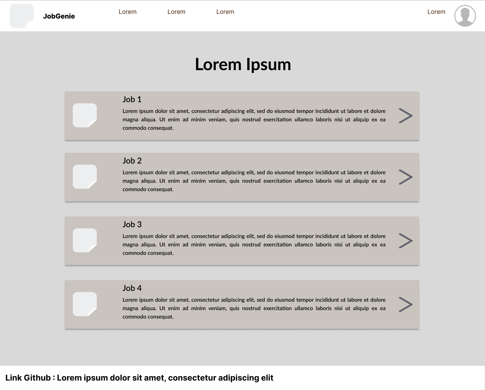
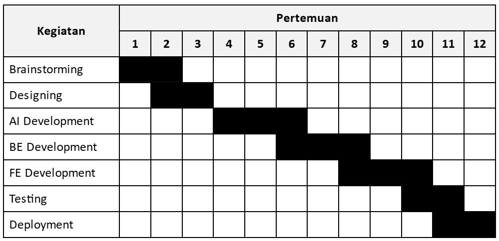

# **JobGenie - Senior Project TI**
Departemen Teknik Elektro dan Teknologi Informasi, Fakultas Teknik Universitas Gadjah Mada Yogyakarta

## **Kelompok Info Loker!**

**Ketua Kelompok:** Gabriella Eileen Gultom - 22/503523/TK/55019

**Anggota 1:** Hezekiel Sitepu - 22/498213/TK/54640

**Anggota 2:** Nasywa Rahmadhani P.S. - 22/498375/TK/54665

## **Nama dan Jenis Produk**
**Nama Produk:** JobGenie 

**Jenis produk:** AI-powered Job Matching Web-App

## **Latar Belakang & Permasalahan** 
Pekerjaan dibutuhkan orang-orang untuk memenuhi kebutuhan hidup, mendapatkan upah, atau mencapai tujuan tertentu. Pekerjaan ini memungkinkan seseorang memenuhi kebutuhan hidup sehari-hari, yang terbagi menjadi kebutuhan primer, sekunder, dan tersier. Selain itu, pekerjaan juga dapat menambah pengalaman, yang berguna untuk membuka usaha sendiri di masa depan dan mengembangkan keterampilan interpersonal, komunikasi, serta kepemimpinan. Pekerjaan yang dilakukan juga merupakan salah satu bentuk pengembangan diri dan kontribusi kepada masyarakat di sekitar.

Namun, mencari pekerjaan, terutama bagi fresh graduate dan pengangguran, seringkali menjadi tantangan tersendiri. Tingkat pengangguran terbuka di Indonesia pada Februari 2024 mencapai 4,82%, sebagian besar berasal dari kalangan lulusan baru. Banyak perusahaan menetapkan syarat pengalaman kerja minimal, sehingga menyulitkan fresh graduate yang belum memiliki kesempatan untuk mengumpulkan pengalaman.  Selain itu, kebijakan perekrutan perusahaan seringkali tidak mengakomodasi kebutuhan dan kondisi lulusan baru, misalnya, dengan menetapkan batas usia maksimal yang tidak relevan dengan kemampuan pelamar.

## **Rumusan Permasalahan**
Banyak pelamar kerja yang kesulitan untuk mencari pekerjaan. Hal ini disebabkan oleh sulitnya menyesuaikan pekerjaan dengan CV yang dimiliki, minimnya akses terhadap rekomendasi lowongan, dan kurangnya efisiensi dalam pencarian kerja.Banyak pelamar kerja juga menghadapi tantangan dalam menyesuaikan kriteria mereka dengan persyaratan yang ditetapkan oleh perusahaan. Tidak jarang, pelamar mengajukan lamaran ke berbagai posisi tanpa benar-benar memahami apakah kualifikasi mereka sesuai dengan yang dibutuhkan. Hal ini menyebabkan rendahnya tingkat keberhasilan dalam proses seleksi kerja. Selain itu, kurangnya persiapan sebelum melamar pekerjaan, seperti tidak melakukan riset terhadap perusahaan atau tidak menyesuaikan CV dengan deskripsi pekerjaan, membuat banyak kandidat gagal dalam tahap wawancara atau seleksi awal.

Masalah lainnya adalah kecenderungan sebagian pelamar untuk melamar pekerjaan secara sembarangan tanpa mempertimbangkan kecocokan dengan keahlian dan minat mereka. Hal ini dapat menyebabkan ketidakpuasan dalam bekerja, rendahnya produktivitas, serta tingginya angka turnover karyawan dalam perusahaan.

## **Penjelasan Solusi Produk**
JobGenie adalah web-app berbasis AI yang membantu pencari kerja menemukan pekerjaan yang sesuai dengan keterampilan, pengalaman, dan preferensi mereka. AI menganalisis CV dan rekomendasi pekerjaan berdasarkan skill, bukan hanya keyword sehingga memungkinkan rekomendasi lowongan yang lebih akurat. Harapannya,  JobGenie dapat membantu menyediakan informasi tentang lowongan yang mungkin tidak terjangkau pekerja dan membantu memilah lowongan di mana pekerja tersebut memiliki kesempatan besar untuk diterima.

## **Fitur**
- **Input CV:** Input berupa PDF atau text file. Kemudian, informasi penting seperti pengalaman kerja, skill, dan pendidikan akan diekstrak.
- **Job-Matching:** Memberi output berupa rekomendasi pekerjaan berdasarkan CV, skill, dan preferensi pengguna.
- **Filter Hasil:** Filter lowongan pekerjaan berdasarkan preferensi lokasi, industri, tipe pekerjaan (full time, part time, internship) dan gaji apabila informasi tersebut tersedia di lowongan kerja yang ada.

## **Analisis Kompetitor**
### **Kompetitor 1: LinkedIn Job Search**

| **Nama Kompetitor** | LinkedIn Job Search |
| --- | --- |
| **Jenis Kompetitor** | Direct Competitor |
| **Jenis Produk** | Platform pencarian kerja berbasis AI |
| **Target Customer** | Fresh graduate, profesional yang mencari pekerjaan baru, dan perusahaan yang membutuhkan kandidat berkualitas |

 

| **Kelebihan** | **Kekurangan** |
| --- | --- |
| Memiliki jaringan profesional yang luas dan terintegrasi dengan profil LinkedIn | Fitur AI kadang kurang akurat dalam merekomendasikan pekerjaan jika profil tidak diisi dengan lengkap |
| AI yang kuat untuk mencocokkan kandidat dengan lowongan yang sesuai berdasarkan pengalaman dan keterampilan | Fitur AI kadang kurang akurat dalam merekomendasikan pekerjaan jika profil tidak diisi dengan lengkap |
| Banyak perusahaan besar yang menggunakan LinkedIn untuk merekrut karyawan | Tidak semua perusahaan menggunakan LinkedIn untuk rekrutmen, terutama perusahaan kecil atau startup lokal |

 

| **Key Competitive Advantage & Unique Value** |
| --- |
| JobGenie menggunakan AI yang menganalisis CV berdasarkan keterampilan, bukan sekadar keyword, sehingga rekomendasi pekerjaan lebih akurat |

### **Kompetitor 2: Chatbot Lintang UGM**

| **Nama Kompetitor** | Kalibrr |
| --- | --- |
| **Jenis Kompetitor** | Indirect Competitor |
| **Jenis Produk** | Platform rekrutmen |
| **Target Customer** | Perusahaan yang mencari kandidat dengan skill spesifik |

 

| **Kelebihan** | **Kekurangan** |
| --- | --- |
| Memiliki sistem asesmen skill untuk meningkatkan peluang kerja | Masih belum akurat |
| Lebih berfokus pada kebutuhan perusahaan, bukan job-seeker | Tidak ada fitur pencocokan berbasis AI untuk individu |

 

| **Key Competitive Advantage & Unique Value** |
| --- |
| Kalibrr lebih sesuai untuk rekrutmen berbasis tes, tapi JobGenie menawarkan solusi yang lebih personal dengan job-matching berbasis AI |

### **Kompetitor 3: Chatbot LUIS**

| **Nama Kompetitor** | Jobstreet |
| --- | --- |
| **Jenis Kompetitor** | Indirect Competitor |
| **Jenis Produk** | Platform pencarian dan lamaran kerja online |
| **Target Customer** | Pencari kerja umum dan perusahaan yang mencari kandidat untuk berbagai posisi |

 

| **Kelebihan** | **Kekurangan** |
| --- | --- |
| Memiliki database lowongan kerja yang luas di berbagai industri | Tidak memiliki sistem rekomendasi pekerjaan berbasis AI yang dipersonalisasi |
| Memudahkan pencari kerja untuk melamar banyak pekerjaan dengan sekali klik | Tidak ada fitur optimasi CV ATS-friendly secara otomatis |

 

| **Key Competitive Advantage & Unique Value** |
| --- |
| JobStreet berfungsi sebagai platform pencarian kerja umum, tetapi JobGenie menawarkan solusi job-matching berbasis AI yang dipersonalisasikan, membantu pencari kerja menemukan pekerjaan yang paling sesuai dengan keahlian dan preferensi mereka |

 

## **Metodologi SDLC**

**Metodologi yang digunakan:** Agile

## **Alasan pemilihan Agile**
Dikarenakan JobGenie memiliki fitur utama AI job matching maka pengembagan bertahap dan iteratif lebih cocok digunakan dikarenakan butuhnya perubahan berdasarkan feedback pengguna secara cepat. JobGenie juga dapat dikenalkan ke pengguna dengan lebih cepat sehingga feedback pengguna juga didapatkan lebih awal. Agile juga mendukung kolaborasi tim yang lebih baik dibanding dengan SDLC Waterfall. 

Framework Agile yang kami terapkan merupakan Kanban yang terintegrasi dengan repository Github. Dengan Kanban board, visualisasi workflow akan menjadi lebih jelas dan terorganisir.

## **Tujuan Produk**
Tujuan utama dari JobGenie adalah untuk membantu para pencari lowongan kerja mencari lowongan dengan lebih efektif dan efisien. JobGenie dapat melakukan scan pada CV ATS dan mendapatkan data-data dari CV tersebut. Dari data-data tersebut JobGenie akan melakukan pencarian untuk lowongan paling sesuai. Pengguna juga dapat memasukkan beberapa data lain seperti preferensi perusahaan, lokasi, dan lain sebagainya. 

## **Pengguna potensial**
- **Pencari Kerja Fresh Graduate:** Akses ke lowongan kerja yang sesuai dengan bidang studi dan keterampilan mereka.
- **Pekerja yang sedang berkarier:** Mencari peluang kerja yang lebih baik sesuai dengan pengalaman, keterampilan baru, dan kenaikan gaji.
- **Freelancer dan Pekerja Kontrak:** Akses ke proyek atau pekerjaan jangka pendek sesuai dengan spesialisasi mereka.
- **Perusahaan dan Perekrut:** Melakukan promosi lowongan pekerjaan perusahaan mereka.

## **Use Case Diagram**

## **Functional Requirements**

## **Entity Relationship Diagram**

## **Low Fidelity Wireframe**
**Landing Page**

**Page Pencarian**

**Page Hasil Pencarian**

## **Gantt-Chart**

## **Referensi**
Harini Priya, B. R., Kannimalar, K., Saranya, S. B., & Subbulakshmi, B. (2021). A Machine Learning Approach for Personalized Job Recommendation System. Thiagarajar College of Engineering, Madurai, Tamil Nadu, India.
Universitas Sains & Teknologi Komputer (STEKOM). (n.d.). Kenapa sekarang cari kerja susah? Diakses pada 15 Februari 2025, dari https://stekom.ac.id/artikel/kenapa-sekarang-cari-kerja-susah